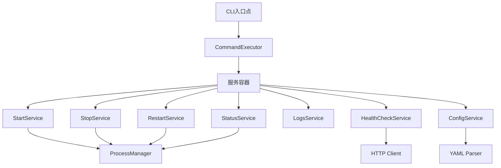

# CLI 服务层实现 Overview

## 概述

CLI服务层封装了CLI的核心业务逻辑，提供可重用的服务接口。本模块通过服务类实现命令执行逻辑、服务编排和业务逻辑封装。

## 服务层架构

### 1. 服务分类
- 命令执行服务
- 配置管理服务
- 进程管理服务
- 日志管理服务

### 2. 依赖注入
- 使用依赖注入管理服务依赖
- 实现服务生命周期管理
- 支持服务替换和测试

## 服务依赖关系

服务初始化顺序：
1. ProcessManager (进程管理器)
2. ConfigService (配置服务)
3. StartService (启动服务) 等其他命令服务

## 各服务模块简介

### 1. 命令执行服务
- 实现CLI命令的执行逻辑
- 提供统一的命令执行接口
- 处理命令执行结果和错误

### 2. 配置管理服务
- 加载和保存配置文件
- 验证配置的有效性
- 提供配置访问接口

### 3. 进程管理服务
- 管理服务器进程的生命周期
- 处理PID文件
- 实现安全的进程操作

### 4. 服务编排和依赖注入
- 管理服务之间的依赖关系
- 实现服务的自动装配
- 提供统一的服务访问接口

### 5. 业务逻辑封装
- 封装核心业务逻辑
- 实现命令解析和处理
- 提供可重用的业务功能

### 6. 测试策略
- 提供服务的单元测试
- 实现集成测试方案
- 确保服务的可靠性

## 可扩展性说明

服务层设计支持插件化扩展：
- 服务可通过接口实现替换
- 支持自定义中间件
- 配置支持动态加载

## 关键字段验证摘要

| 字段 | 类型 | 默认值 | 示例值 | 验证逻辑 | 限制范围 | 安全建议 |
|------|------|--------|--------|----------|----------|----------|
| host | str | "0.0.0.0" | "127.0.0.1" | IP/域名格式验证 | 合法IP或域名 | 避免使用通配符 |
| port | int | 31301 | 8080 | 范围验证 | 1024-65535 | 避免系统保留端口 |
| n_ctx | int | 2048 | 4096 | 范围验证 | 1-32768 | 根据内存容量调整 |
| n_threads | int | 8 | 4 | 范围验证 | 1-CPU核心数 | 不超过CPU核心数 |
| max_concurrent_requests | int | 10 | 50 | 范围验证 | 1-1000 | 根据系统资源调整 |
| rate_limit_requests | int | 60 | 100 | 范围验证 | 0-10000 | 防止DoS攻击 |
| rate_limit_window | int | 60 | 30 | 范围验证 | 1-3600 | 合理设置时间窗口 |

## 版本信息
- 版本: 1.0
- 创建日期: 2026-02-12
- 最后更新: 2026-02-12